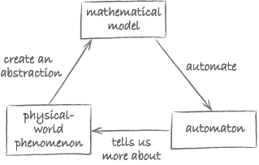

# Coding Club 1

## Recap

- **30 Days of python [YouTube Playlist](https://www.youtube.com/watch?v=RGor6fssp6c&list=PLEsfXFp6DpzQjDBvhNy5YbaBx9j-ZsUe6)**

  - [ ] Python 3.8.x intallation [link](https://www.youtube.com/watch?v=RGor6fssp6c)
  - [ ] Numbers, Variables and Strings [link](https://www.youtube.com/watch?v=pLniTMTW0vE)
  - [ ] Lists & Dictionaries [link](https://www.youtube.com/watch?v=NqacT1CjkmQ&list=PLEsfXFp6DpzQjDBvhNy5YbaBx9j-ZsUe6&index=3)
  - [ ] Iteration & Loops [link](https://www.youtube.com/watch?v=iTa1ZnWdIS0&list=PLEsfXFp6DpzQjDBvhNy5YbaBx9j-ZsUe6&index=4)
  - [ ] Conditionals & Control Flow [link](https://youtu.be/ZbdXzqO0uLo)
  - [ ] String Formatting & F Strings [link](https://youtu.be/pZIwn52DEsU)
  - [ ] Functions & Python Modules [link](https://youtu.be/W9PN20FE3sE)
  - [ ] Importing - Internal & External [link](https://youtu.be/yhF6wAgs3_E)
  - [ ] Send Email & Read Inbox [link](https://youtu.be/6DD4IOHhNYo)
  - [ ] Files - Create, Read & Download [link](https://youtu.be/Rf9ShctbZZQ)
  - [ ] Classes and State [link](https://youtu.be/cRJgLAA2KeI)

## Abstract Data Types

- What is abstract data types?
-

## Abstraction in Programming

- Abstraction as Modeling
- Abstraction as Encapsulation

## Topics covered

- how do we model real world problem into a computer programm
- Concept of Computational Problem
- Automation

### String Methods

```python
# capitalize() : converts the first character to uppercase
greeting = "hello world. hello geo!"
greeting = greeting.capitalize()
print(greeting)
```

```python
# lower() : Converts string into lower case
greeting = "HELLO WORLD"
greeting = greeting.lower()
print(greeting)
```

```python
# split(): Splits the string at the specified separator, and returns a list
greeting = "Hello world"
greeting = greeting.split(" ")
print(greeting)
```

```python
# join() : Joins the elements of an iterable to the end of the string
words = ['Hello', 'world']
greeting = ",".join(words)
print(greeting)
```

```python
# join() : Joins the elements of an iterable to the end of the string
dist  = {"Hello": "Hola"}
greeting = "Hello John Doe!"
translated_greeting = greeting.translate(dist)
print(translated_greeting)
```

## Computational thinking and abstraction


