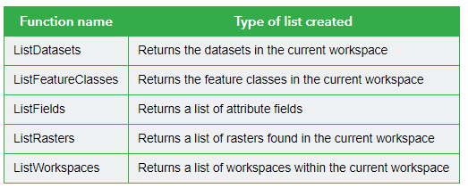

# Coding Club 2

## Common scripting workflow

1. Import Arcpy

```Python
import arcpy
```

2. Set environment

```Python
arcpy.env.workspace = r"c:\data"
arcpy.env.cellSize = 10
arcpy.env.overwriteOutput = True
```

3. Create list of GIS objects:

```python
# List may contain list of properties (values) or dataset
distance_list = [100, 200, 300]
shp_list = ["road.shp", "river.shp", "tower.shp"]

# We can use arpy functions to generate list
arcpy.env.workspace = r"C:\EsriTraining\PythonGP\Data\SanJuan.gdb"

# List all featureclass
fc_list = arcpy.ListFeatureClasses()

# Filter by feature_type
poly_list = arcpy.ListFeatureClasses(feature_type="Polygon")
```



1. Iterate over the list

```python
for shp in shp_list:
  pass
```

5. Geoprocessing

```python
for shp in shp_list:
  pass
```

- [ ] Buffer tool demonstartion
- [ ] Buffer tool exercise

## Accessing Data

### Describing a data

```Pyhon
desc = arcpy.Describe(r"C:\EsriTraining\PythonGP\Data\SanJuan.gdb\Lakes")
```

```python
print(desc.shapeType)
print(desc.extent.width)
print(desc.extent.XMin)
print(desc.extent.YMin)
```

### Exercise 2.1

Use a web search to find ArcGIS Pro documentation and using the documentation for SpatialReference class find the following:

- [ ] Spatial Reference Name
- [ ] Linear unit of the spatial reference
- [ ] Metres per unit of the spatial reference
- [ ] Factory Code or Well Known Identifier of the Spatial Reference
